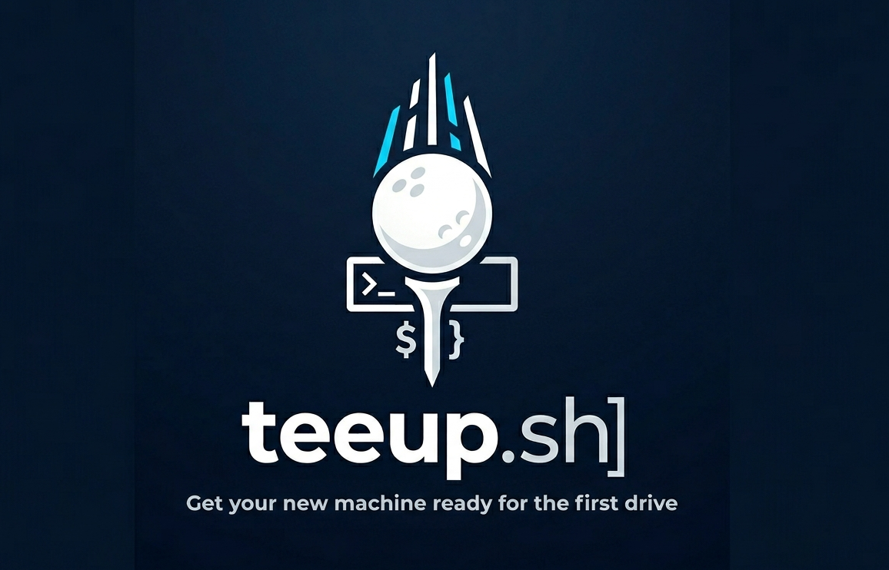

<p align="center">
  
</p>

<h1 align="center">
  
  teeup.sh
</h1>

<p align="center">
  Get your new machine ready for the first drive.
</p>

This repository contains `teeup.sh`, a cross-platform developer setup script. It configures your workspace and installs essential tooling so you can get straight to work.

Through an interactive wizard, teeup provisions a complete development environment, including: 

- **Package Management**: Homebrew or MacPorts on macOS, APT or DNF on Linux   
- **Terminal & Shell**: zsh with Powerlevel10k, or bash with bash-completion + Starship — tool initialization is shared across both via `~/.teeupshrc`   
- **Development Tools**: UV, SDKMAN!, rbenv, rustup, and Emacs    
- **Containers**: Colima bundled with the Docker CLI   
- **Applications**: Bruno and Obsidian   
- **Utilities**: A curated suite of common command-line tools   

---

## ✨ Features

- ✅ Idempotent: safe to run multiple times — skips already installed items  
- ✅ Works on **macOS** and **Linux** (first-class: Ubuntu + Fedora)  
- ✅ Works on both **Apple Silicon** and **Intel** Macs  
- ✅ Installs **Xcode CLT** and **Rosetta 2** (if required, macOS only)  
- ✅ Bootstraps:
  - **Package manager**: `PACKAGE_MANAGER=auto` resolves by platform (`homebrew`/`macports` on macOS, `apt`/`dnf` on Linux)
  - **zsh** in either plain mode (default) or **Oh My Zsh** mode, both with **Powerlevel10k**
  - **Core CLI utilities**: `git`, `wget`, `curl`, `jq`, `htop`, `tree`, `tmux`, `ripgrep`, `fd`, `gnupg`  
  - **Python via UV** (default, recommended) — 10-100x faster than pip, manages Python versions, virtual envs, and tools  
  - **Python via pyenv** + `pyenv-virtualenv`, `pipx`, `poetry` (legacy option, set `USE_UV=false`)  
  - **Java via SDKMAN!** + optional `maven` and `gradle`  
  - **Ruby via rbenv** + RubyGems and Bundler
  - **Rust via rustup** — official toolchain installer with `rustc`, `cargo`, and `rustup`
  - **Docker runtime + CLI** (Colima on macOS, distro packages on Linux; no Docker Desktop required)  
  - **Emacs** with a minimal starter config  
  - **Bruno** and **Obsidian** (macOS-only via Homebrew cask)
- ✅ Detects your login shell (`bash` or `zsh`) and wires tool init into a shared `~/.teeupshrc` sourced by both shells; override with `TARGET_SHELL`
- ✅ Adds the invoking user to the `docker` group on Linux so `docker` works without `sudo` (after re-login)
- ✅ Dotfiles your way: use your own repo (`--dotfiles <path|url>` or a sibling `dotfiles`), generate a neutral starter you own (`--init-dotfiles`), or fall back to minimal managed shell blocks
- ✅ Can reconcile existing shell config by disabling old Antigen, pyenv, and stale hardcoded path lines
- ✅ Adds sensible aliases and environment initialization (`pyenv`, `sdkman`, `colima`) for your target shell when no dotfiles repo is present
  - Includes shortcuts like `ll`, `cls`, `grv`, `colima-start`, and `colima-stop`
- ✅ Reports total install duration in the final summary
- ✅ Optional macOS defaults tuning (hidden behind a toggle)  
- ✅ Clear logs with ✅/⚠️ markers and an install summary at the end  

---

## ⚙️ Installation

1. Clone or download this repo.
    ```
    git clone <this-repo-url>
    cd teeup.sh
    ```
2.   Make the scripts executable:  
    ```
    chmod +x teeup.sh teeup-wizard.sh
    ```
3. Run it:

```
./teeup.sh            # Minimal base: package manager + login shell + CLI tools
./teeup.sh --all      # The full curated stack (language runtimes, Emacs, Docker, apps)
```

By default teeup installs a **lean base** (the `base` profile): a package manager,
your login shell, and core CLI utilities. Opt into the rest with `--all`, pick
exact modules with `--only`, or trim the full stack with `--except`. This keeps a
bare run neutral — you decide what else gets installed.

### Package Manager Selection

By default, setup uses `PACKAGE_MANAGER=auto`:

- macOS 13 or newer: **Homebrew**
- macOS 12 or older: **MacPorts**
- Ubuntu/Debian: **APT**
- Fedora/RHEL-family: **DNF**

MacPorts itself is not installed by the script. On older Macs, install the official pkg for your macOS version first:

```sh
open https://www.macports.org/install.php
```

Then rerun setup. You can override the choice:

```sh
PACKAGE_MANAGER=homebrew ./teeup.sh
PACKAGE_MANAGER=macports ./teeup.sh
PACKAGE_MANAGER=apt ./teeup.sh
PACKAGE_MANAGER=dnf ./teeup.sh
```

---

## 🧙 Interactive Wizard Mode

For a guided, step-by-step experience, use the interactive wizard:

```sh
./teeup-wizard.sh
```

The wizard will guide you through:

1. **Setup Type Selection** - Choose between minimal base (recommended), full setup, custom module selection, or migration
2. **Module Selection** - Toggle which components to install
3. **Package Manager Selection** - Auto (resolves by OS) or explicit (Homebrew/MacPorts on macOS, APT/DNF on Linux)
4. **Shell Configuration** - On Linux, choose bash or zsh; for zsh, plain (default) or Oh My Zsh
5. **Python Configuration** - Choose between UV (recommended) or pyenv, and select version
6. **Java Configuration** - Select Java version (21, 17, 11, or custom)
7. **Ruby Configuration** - Select Ruby version, RubyGems update behavior, and optional Bundler version
8. **Docker Configuration** - Configure Colima VM resources (CPUs, memory, disk)
9. **Additional Options** - Dotfiles (use your own, generate a neutral starter, or none), existing-config reconciliation, cleanup, and macOS defaults tuning
10. **Review & Confirm** - See a summary before installation begins

> Note: The wizard detects your platform. On Linux it offers APT/DNF selection and asks whether your login shell is bash or zsh; on macOS it offers Homebrew/MacPorts and zsh modes.

### Wizard Features

- 🎨 **Colorful UI** - Clear visual hierarchy with colors and emojis
- ✅ **Toggle Selection** - Easily toggle modules on/off
- 📋 **Summary Review** - Review all choices before installation
- 🔄 **Migration Support** - Guided pyenv to UV migration
- 🔍 **Dry-Run Mode** - Preview all commands without making changes
- ✔️ **Input Validation** - Validates all user inputs with helpful error messages
  - Version format validation (Python versions)
  - Numeric range validation (CPUs: 1-32, Memory: 2-128GB, Disk: 10-500GB)
  - Menu choice validation (ensures valid selections)
  - Retry loops allow fixing errors without restarting

## 🧩 Profiles & Partial Execution

teeup resolves which modules run from a **profile** (`base` or `full`), then lets
you refine with flags. Precedence: `--only` (explicit allowlist) > explicit
`RUN_*` env vars > profile default; `--except` then subtracts.

```sh
# Minimal base (default): package manager + login shell + CLI
./teeup.sh

# Full curated stack
./teeup.sh --all                 # same as: TEEUP_PROFILE=full ./teeup.sh

# Full stack, minus the GUI apps and Docker
./teeup.sh --all --except apps,docker

# Add a single runtime to the base without the rest
./teeup.sh --all --except java,ruby,rust,docker,apps,emacs
RUN_RUST=true ./teeup.sh          # or just enable one module on top of base
```

Run only specific modules using the `--only` flag:

```sh
# Run only Python setup
./teeup.sh --only python

# Run only zsh setup, defaulting to plain zsh
./teeup.sh --only zsh

# Use Oh My Zsh mode
ZSH_MODE=ohmyzsh ./teeup.sh --only zsh

# Run multiple modules
./teeup.sh --only zsh,python,java,docker

# Install only Rust
./teeup.sh --only rust

# Install only Ruby
./teeup.sh --only ruby

# List available modules
./teeup.sh --list-modules
```

### Available Modules

| Module | Description |
|--------|-------------|
| `homebrew` | Package manager setup; compatibility module name resolved by OS |
| `shell` | Configure your login shell — zsh: Powerlevel10k + plugins; bash: bash-completion + Starship |
| `zsh` | Force zsh setup (Powerlevel10k + plugins) |
| `ohmyzsh` | Legacy alias for `zsh` with `ZSH_MODE=ohmyzsh` |
| `bash` | Force bash setup (bash-completion + Starship) |
| `cli` | Core CLI utilities (git, jq, ripgrep, etc.) |
| `python` | Python environment (UV or pyenv/poetry) |
| `java` | SDKMAN! + Java + Maven/Gradle |
| `ruby` | Ruby via rbenv + RubyGems + Bundler |
| `rust` | Rust toolchain via rustup (`rustc`, `cargo`) |
| `emacs` | Emacs editor + minimal config |
| `docker` | Docker runtime + CLI (Colima on macOS, distro packages on Linux) |
| `apps` | GUI apps (Bruno, Obsidian; macOS-only currently) |

> **Note:** Package manager setup is automatically included when other modules depend on it. The module is still named `homebrew` for backward compatibility.

## 🔍 Dry-Run Mode

Preview all commands before execution without making any changes to your system:

```sh
# Preview the minimal base setup
./teeup.sh --dry-run

# Preview the full stack
./teeup.sh --dry-run --all

# Preview specific modules
./teeup.sh --dry-run --only python,docker

# Use with wizard (select dry-run in Additional Options)
./teeup-wizard.sh
```

**Dry-run mode will:**
- ✅ Display all commands that would be executed
- ✅ Show configuration that would be applied
- ✅ Verify module dependencies
- ✅ Check for already-installed tools
- ❌ Not install or modify anything
- ❌ Not update configuration files

This is useful for:
- Testing the script on a new machine
- Understanding what will be installed
- Troubleshooting issues
- Learning the installation process

## 🔄 Migrating from pyenv to UV

If you previously installed pyenv and want to switch to UV:

```sh
./teeup.sh --migrate-to-uv
```

This will:
1. Install UV alongside pyenv (non-destructive)
2. Install your Python version via UV
3. Migrate pipx tools to `uv tool`
4. Update shell config (disables active pyenv init, adds UV path when dotfiles are not installed)
5. Provide cleanup instructions

### After Migration

```sh
# Reload shell (open a new terminal, or re-exec your shell)
exec "$SHELL"

# Verify UV is working
uv --version   
uv python list --only-installed  

# Optional cleanup (after verifying everything works)
rm -rf ~/.pyenv
pipx uninstall-all
brew uninstall pipx pyenv pyenv-virtualenv  # if those were installed with Homebrew
```

> ⚠️ **Keep pyenv installed** until you've verified UV works for all your projects!

## 🛠️ Customization

You can override versions or disable features per run using environment variables:

```sh
# Versions
PYTHON_VERSION="${PYTHON_VERSION:-3.12.5}"          # Override by: PYTHON_VERSION=3.13.x ./teeup.sh
JDK_VERSION="${JDK_VERSION:-21.0.4-tem}"            # SDKMAN version identifier (e.g., "21.0.4-tem" for Temurin 21)
RUBY_VERSION="${RUBY_VERSION:-3.4.9}"               # Override by: RUBY_VERSION=4.0.3 ./teeup.sh
BUNDLER_VERSION="${BUNDLER_VERSION:-}"              # Optional Bundler version; empty installs latest

# Profile (default module set when none chosen explicitly)
TEEUP_PROFILE="${TEEUP_PROFILE:-base}"              # base (pkg mgr + shell + cli) or full

# Feature toggles
USE_UV="${USE_UV:-true}"                            # Use uv instead of pyenv/poetry/pipx (recommended)
INSTALL_PY_TOOLS="${INSTALL_PY_TOOLS:-true}"        # Install Python tools (via uv tool or pipx)
RUBYGEMS_UPDATE="${RUBYGEMS_UPDATE:-true}"          # Update RubyGems after installing Ruby
ZSH_MODE="${ZSH_MODE:-plain}"                       # plain or ohmyzsh
TARGET_SHELL="${TARGET_SHELL:-auto}"                # Login shell to configure: auto, bash, or zsh
PACKAGE_MANAGER="${PACKAGE_MANAGER:-auto}"          # auto, homebrew, macports, apt, or dnf
STRICT_PLATFORM="${STRICT_PLATFORM:-false}"         # fail instead of skipping unsupported modules
INSTALL_DOTFILES="${INSTALL_DOTFILES:-true}"        # Symlink a dotfiles overlay (see --dotfiles / --init-dotfiles)
RECONCILE_EXISTING_CONFIG="${RECONCILE_EXISTING_CONFIG:-false}"  # Disable old shell config lines
CLEANUP_HOMEBREW_OVERLAPS="${CLEANUP_HOMEBREW_OVERLAPS:-false}"  # Remove verified overlaps in MacPorts mode
ALLOW_HOMEBREW_CASK_FALLBACK="${ALLOW_HOMEBREW_CASK_FALLBACK:-false}"  # Use existing Homebrew casks in MacPorts mode
TUNE_DEFAULTS="${TUNE_DEFAULTS:-false}"             # Apply some macOS defaults
CREATE_MIN_EMACS_INIT="${CREATE_MIN_EMACS_INIT:-true}"
CREATE_OBSIDIAN_VAULT="${CREATE_OBSIDIAN_VAULT:-false}"  # Create starter vault folder

# Colima defaults (edit as desired)
COLIMA_PROFILE="${COLIMA_PROFILE:-default}"
COLIMA_CPUS="${COLIMA_CPUS:-4}"
COLIMA_MEMORY="${COLIMA_MEMORY:-8}"     # in GiB
COLIMA_DISK="${COLIMA_DISK:-60}"        # in GiB
COLIMA_RUNTIME="${COLIMA_RUNTIME:-docker}"  # docker or containerd

```

### Dotfiles: a neutral base + your overlay

teeup treats dotfiles as **a neutral base it owns + a personal overlay you bring**,
so it never imposes one person's taste:

- **Bring your own** — point teeup at any dotfiles directory or git repo:
  ```sh
  ./teeup.sh --dotfiles ~/code/my-dotfiles
  ./teeup.sh --dotfiles https://github.com/you/dotfiles.git
  ```
  A sibling `dotfiles/` directory next to `teeup.sh` is auto-detected and used by
  default (so an author's own checkout "just works").
- **Generate a neutral starter you own** — if you have no dotfiles yet, scaffold a
  clean set from `templates/dotfiles/` (no editor lock-in, no personal aliases),
  then customize and version-control it:
  ```sh
  ./teeup.sh --init-dotfiles ~/dotfiles
  ```
- **None** — with no overlay and no `--init-dotfiles`, setup falls back to small
  managed shell blocks written to `~/.teeupshrc` and sourced from your rc file.

When an overlay is used, the script symlinks the shared files (`shellrc.common`,
`teeupshrc`, `gitconfig`, `tmux.conf`) plus the files for your **target login
shell only** (segregated): zsh gets `zshrc`/`zprofile`; bash gets
`bashrc`/`.bash_profile`/`profile` and a starter `starship.toml`
(→ `~/.config/starship.toml`).

### UV vs pyenv/poetry

By default, the script uses **UV** for Python management. UV is a modern, Rust-based tool that is 10-100x faster than pip and replaces pyenv, poetry, and pipx with a single unified tool.

To use the legacy pyenv/poetry stack instead:
```sh
USE_UV=false ./teeup.sh
```

Legacy pyenv mode is supported on macOS and Linux, but `USE_UV=true` remains the recommended default.

## 🪛 Installed Command-Line Tools and Purpose

| Tool | Purpose |
|-------|------------|
|git| Version control |
|wget| Download files from web|
|curl| Transfer data from or to a server|
|jq| Lightweight json processor|
|htop| Interactive process viewer|
|tree| Display directories as a tree|
|tmux| Terminal Multiplexer for managing sessions|
|ripgrep (rg) | Fast text searches across files|
|fd| Simple, fast alternative to find|
|gnupg|Encryption, signing and key management|
|oh-my-zsh| Framework for managing Zsh configuration|
|powerlevel10k| Fast, flexible Zsh theme with rich prompts|
|starship| Fast, cross-shell prompt (used for bash)|
|bash-completion| Programmable tab-completion for bash|
|zsh-autosuggestions| Fish-like autosuggestions for Zsh|
|zsh-syntax-highlighting| Syntax highlighting for Zsh commands|
|uv| Fast Python package manager (replaces pyenv, poetry, pipx) — default|
|pyenv| Manage multiple Python Versions (legacy, when `USE_UV=false`)|
|pyenv-virtualenv| Virtual environment support for pyenv (legacy)|
|pipx| Install and run Python CLI tools in isolated environments (legacy)|
|poetry| Python packaging and dependency management (legacy)|
|black| Python code formatter|
|ruff| Python Linter and formatter|
|httpie| User-friendly HTTP client|
|SDKMAN!| Manage parallel versions of Java|
|maven| Java build automation and dependency management|
|rbenv| Manage Ruby versions|
|ruby-build| Compile and install Ruby versions for rbenv|
|bundler| Ruby dependency management|
|rustup| Official Rust toolchain installer and version manager|
|cargo| Rust package manager and build tool|
|emacs| Goto Text editor|
|colima| Lightweight VM for container runtimes (Docker runtime replacement)|
|docker| Docker CLI to interact with containers|

## 🔤 Oh My Zsh Git Aliases

The `git` plugin provides 150+ aliases. Here are the most commonly used:

| Alias | Command |
|-------|---------|
| `g` | `git` |
| `gst` | `git status` |
| `ga` | `git add` |
| `gaa` | `git add --all` |
| `gcmsg` | `git commit -m` |
| `gc!` | `git commit --amend` |
| `gco` | `git checkout` |
| `gcb` | `git checkout -b` |
| `gb` | `git branch` |
| `gba` | `git branch -a` |
| `gbd` | `git branch -d` |
| `gp` | `git push` |
| `gpf!` | `git push --force` |
| `gl` | `git pull` |
| `gf` | `git fetch` |
| `gfa` | `git fetch --all --prune` |
| `gd` | `git diff` |
| `gds` | `git diff --staged` |
| `glog` | `git log --oneline --decorate --graph` |
| `gloga` | `git log --oneline --decorate --graph --all` |
| `gsta` | `git stash push` |
| `gstp` | `git stash pop` |
| `gstl` | `git stash list` |
| `grb` | `git rebase` |
| `grbi` | `git rebase -i` |
| `gm` | `git merge` |
| `gcp` | `git cherry-pick` |
| `grh` | `git reset HEAD` |
| `grhh` | `git reset HEAD --hard` |

> **Tip:** Run `alias | grep git` to see all available git aliases.

## 🔧 Using Bruno API Client

Bruno is an open-source alternative to Postman that stores collections as plain text files, making them git-friendly and easy to collaborate on.

### Getting Started

Once installed, Bruno can be found in your Applications folder. Collections are stored locally as `.bru` files.

### Importing from Postman

1. **Export from Postman:**
   - In Postman, select your collection
   - Click the three dots → Export
   - Choose **Collection v2.1** format
   - Save the JSON file

2. **Import to Bruno:**
   - Open Bruno
   - Click **Import Collection**
   - Select the exported JSON file
   - Choose a folder location for your collection

### Importing from cURL

Bruno supports importing cURL commands:

1. In Bruno, click **Import** → **cURL**
2. Paste your cURL command
3. Bruno will convert it to a request

### Collection Structure

Bruno collections are stored as plain text:

```
~/Documents/Bruno/
├── my-api/
│   ├── bruno.json          # Collection metadata
│   ├── Get Users.bru       # Individual request
│   └── Create User.bru     # Another request
```

### Sample `.bru` File Format

```bru
meta {
  name: Get Users
  type: http
  seq: 1
}

get {
  url: https://api.example.com/users
  body: none
  auth: bearer
}

auth:bearer {
  token: {{apiToken}}
}

headers {
  Content-Type: application/json
}
```

### Environment Variables

Bruno supports environment variables for different stages:

1. Click on collection name → **Environments**
2. Add variables like `baseUrl`, `apiToken`, etc.
3. Use them in requests: `{{baseUrl}}/users`

### Why Bruno over Postman?

- ✅ **Git-friendly:** Collections are plain text files
- ✅ **Offline-first:** Works without internet
- ✅ **Privacy:** No cloud sync required
- ✅ **Open-source:** Free and community-driven
- ✅ **Fast:** Lightweight and performant

## Post Installation
   - Open a new terminal or run: exec "$SHELL"
   - Verify:
      
       # If using UV (default)
       ```
       uv --version
       uv python list --only-installed
       python --version
       ```
       
       
       # If using pyenv (USE_UV=false)
       ```
       pyenv --version  
       python --version 
       ```
       
       # Java & Docker
       ```
       sdk version  
       java -version  
       docker version  
       colima status  
       emacs --version  
       ```

       # Ruby
       ```
       ruby --version
       gem --version
       bundle --version
       ```

       # Rust
       ```
       rustc --version
       cargo --version
       ```

## Notes:
   - Some steps (Xcode CLT, Rosetta) may prompt or require admin rights.
   - Colima controls the Docker context. If docker fails, try:
       ```
       colima start
       docker context ls
       ```

---

## 🔐 Trust Model

teeup runs vendor install scripts directly from upstream over HTTPS without
checksum verification. The script is only as trustworthy as these endpoints
and your TLS chain. The endpoints used are:

| Tool      | URL                                                                          |
|-----------|------------------------------------------------------------------------------|
| Homebrew  | `https://raw.githubusercontent.com/Homebrew/install/HEAD/install.sh`         |
| Oh My Zsh | `https://raw.githubusercontent.com/ohmyzsh/ohmyzsh/master/tools/install.sh`  |
| UV        | `https://astral.sh/uv/install.sh`                                            |
| SDKMAN!   | `https://get.sdkman.io`                                                      |
| rustup    | `https://sh.rustup.rs`                                                       |
| Starship  | `https://starship.rs/install.sh`                                             |

If you don't want any of these to run, install the corresponding tool
yourself first (teeup detects existing installs and skips them) or run
with `--only` to skip the modules you don't want.

---

## 🧪 Testing

The project includes a test suite to validate both scripts:

```sh
# Run all tests
./tests/run_tests.sh

# Run individual suites
./tests/test_teeup.sh
./tests/test_teeup_behavior.sh
./tests/test_teeup_wizard.sh
```

### Test Coverage

**teeup.sh static tests:**
- Script syntax validation
- Help and list-modules flags
- Environment variable defaults and overrides
- Bash 3.2 compatibility (no Bash 4 syntax)
- Module definitions (package manager, zsh, Python, Java, Docker, Apps)
- UV and pyenv support
- SDKMAN and Colima support

**teeup.sh behavior tests:**
- Dry-run command previews with mocked tools
- Platform resolution (macOS Homebrew/MacPorts, Linux APT/DNF)
- Target-shell routing (bash vs zsh) and `teeupshrc` wiring
- Segregated bash/zsh deployments and Starship-vs-Powerlevel10k selection
- Linux docker-group membership

**teeup-wizard.sh tests:**
- Script syntax validation
- All wizard screens defined
- Helper functions defined
- State variable initialization
- Module list completeness
- Environment variable exports (incl. `TARGET_SHELL`)
- Bash 3.2 compatibility
- Integration with teeup.sh

---

Enjoy your new setup!
