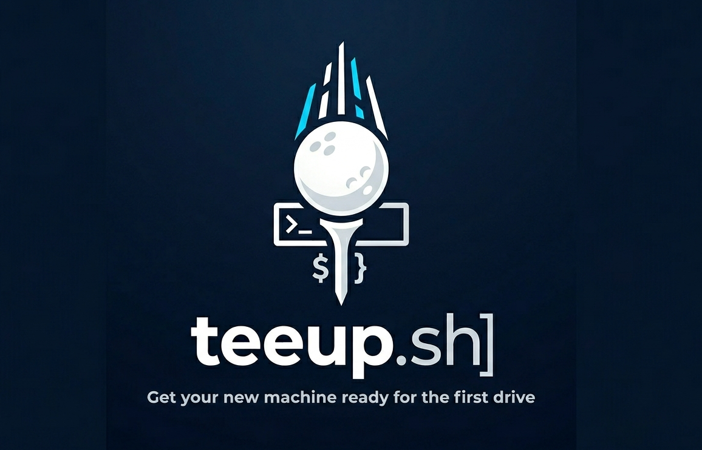

<p align="center">
  
</p>

<h1 align="center">
  
  teeup.sh
</h1>

<p align="center">
  Get your new machine ready for the first drive.
</p>

> **Redesign in progress.** teeup is being rebuilt as a modular, macOS-only
> environment distribution (design:
> `docs/superpowers/specs/2026-09-11-omarchy-inspired-redesign-design.md`).
> The new runtime lives in `bootstrap`, `bin/teeup`, `lib/` and
> `capabilities/`. The previous installer still works from `legacy/`.

## New runtime (preview)

```bash
git clone https://github.com/systemhalted/teeup.sh ~/.local/share/teeup
cd ~/.local/share/teeup
./bootstrap --dry-run     # preview everything it would do
./bootstrap               # run it
teeup status              # what is installed
teeup list                # every capability and its tier
teeup install <name>      # install and configure one capability
teeup theme set catppuccin        # re-render every app's colours, light and dark
teeup install font "Fira Code"    # switch every tool to another Nerd Font
teeup secret set <name>   # store a secret in the macOS Keychain
teeup launch cursor       # open an app, installing its cask on first use
teeup install dev-env go  # install a language runtime through mise
teeup menu                # every teeup action as a keyboard-driven list
teeup config get          # the answers, and which of them a machine file pins
teeup migrate legacy      # retire the old teeup and chezmoi wiring on this Mac
```

~/.local/bin joins your PATH through the shell layer the zsh capability installs, so teeup is spelled ~/.local/bin/teeup until you open a new terminal.

The core tier is complete: `xcode-clt`, `package-manager`, `teeup-runtime`,
`dev-dirs`, `zsh`, `starship`, `cli-tools`, `secrets`, `git`, `ssh`, `github`,
`mise`, `wezterm`, `fonts`, `aerospace`, `keyboard`, `macos-defaults`,
`theme`. The daily tier (`emacs`, `zed`, `firefox-developer-edition`,
`obsidian`) installs at bootstrap when you say yes to it. `neovim`, `vscode`
and `chrome` are lazy: `teeup install <name>` brings one in when you want it.
`teeup list` is always the source of truth.

### Finding your way around

`teeup menu` puts every action behind one list. It uses `gum` when gum is
installed, `fzf` when it is not, and a plain numbered list when neither is
there, so it works over ssh and inside a script. `teeup menu install` opens
straight at the Install submenu; inside a submenu, an empty line, `q` or
Escape goes back one level, and doing the same at the top level leaves the
menu.

The menu is `share/teeup/menu.json`: one JSON object whose keys are dotted
ids, so `install.editors.zed` is a row under `install.editors`. Each row is an
object of one-line strings:

| Field | Meaning |
|---|---|
| `label` | required; what the row shows |
| `icon` | optional; printed before the label |
| `action` | a shell command line; a row with one is a leaf, a row without one is a submenu |
| `when` | a shell condition; the row is hidden when it exits non-zero |
| `title` | header shown when the submenu is open; defaults to `label` |

`when` is why the Install list shrinks as the machine fills up: each row asks
`! teeup has <capability>`, and `teeup has` exits 0 only for something already
installed. Conditions and actions run with the checkout's `bin/` first on
`PATH`.

To add or change rows, write `~/.config/teeup/menu.json` in the same format.
An id that is also in the shipped file replaces that row **whole** and keeps
its position; an id that is not is appended. To hide a shipped row, give it
`"when": "false"`.

`teeup config` manages the answers file:

```bash
teeup config get                       # every answer, and which ones are pinned
teeup config get TEEUP_THEME           # the value the rest of teeup will see
teeup config set TEEUP_NAME Ada Lovelace
teeup config edit                      # $VISUAL or $EDITOR on the file itself
```

Precedence is your answers, then the first of `~/.config/teeup/machines/<hostname>.conf`
and the checkout's own `machines/<hostname>.conf` that exists -- that one file
wins outright, and the two are never merged, because a half-applied machine
file is worse than one file that is clearly in charge. `teeup config set`
never writes the machine file; when the machine file pins the key you are
setting, it says so, because a write that has no effect is otherwise
impossible to notice. A work identity (`TEEUP_WORK_EMAIL` and its companions)
is read only from the machine file, never from the answers, so `teeup config
set TEEUP_WORK_EMAIL ...` refuses and names the machine file to edit instead.
`teeup config edit` checks that the file still parses as shell and rolls your
edit back if it does not -- teeup sources it at the start of every command, so
a broken line would break the verb that would fix it.

### Editors

- **Emacs** runs as a daemon from the `sh.teeup.emacs` LaunchAgent, so
  `emacsclient -t` (the editor git and the shell use) always has a server;
  `emacsclient -c` (a window) also does when the daemon is a GUI build (the
  `emacs-app` cask, or MacPorts' `emacs-app` port, found under
  `/Applications`, `~/Applications` or, on MacPorts, its own applications
  directory). A terminal-only build (MacPorts' plain `emacs` port, or
  Homebrew's `emacs` formula) still runs the daemon, but `emacsclient -c`
  cannot open a window from it, which teeup says at configure time. The
  answer `TEEUP_EMACS_FLAVOR` picks the configuration: `starter` (the
  default: a thin `~/.config/emacs/init.el` over teeup's built-ins-only
  layer), `doom` (Doom cloned into `~/.config/emacs`, then
  `doom install --no-env`), `spacemacs` (cloned into `~/.emacs.d`) or `none`
  (your own configuration, untouched). The wizard asks it with the daily set;
  change it with `./bootstrap --reconfigure`, or pin it in the machine file,
  then run `teeup configure emacs`.
- **Zed** and **VS Code** keep their own `settings.json`
  (`~/.config/zed/settings.json`, which Zed reads whatever `XDG_CONFIG_HOME`
  says, and `~/Library/Application Support/Code/User/settings.json`). teeup
  sets only the theme, font and theme-extension keys in them through `jq`,
  and leaves the rest alone. Comments inside the object do not survive that
  edit, so a file that has them is backed up first; a settings file that is a
  symlink is never written.
- **Neovim** gets the LazyVim starter layout under `~/.config/nvim`, every
  file yours after the first copy, with teeup's layer on `package.path`. A
  pre-existing `~/.config/nvim/init.lua` teeup did not install is backed up
  and replaced, with the diff against your previous file printed. LazyVim
  needs Neovim 0.11.2 or later.

`teeup theme set` and `teeup install font` reach every editor teeup has
installed: each has a themed template that names the theme for the palette
(Modus for Emacs, `catppuccin-mocha`/`catppuccin-latte` for Neovim and the
Catppuccin extension for Zed and VS Code) and a hook that tells a running
editor to pick it up.

Per-machine overrides live in `~/.config/teeup/machines/<hostname>.conf` -- your own file, never in this checkout, so `git pull` never touches it -- sourced after your answers and winning over them: it is where `TEEUP_PACKAGE_MANAGER=macports` or `TEEUP_SKIP="aerospace"` belongs. (`machines/<hostname>.conf` in the checkout itself still works, checked second, for anyone who keeps a fork instead.) It is also the only place a work identity is configured -- teeup's own git/ssh/GitHub identity is a single one, `TEEUP_NAME`/`TEEUP_EMAIL` from the wizard, full stop; a machine that also needs a work identity sets `TEEUP_WORK_EMAIL` here (plus `TEEUP_WORK_GH_HOST` for a GitHub Enterprise host, or `TEEUP_WORK_GH_ACCOUNT` when work is a second account on github.com), which gives that machine a second SSH key uploaded to that identity's own GitHub host and account. See `machines/example.conf.sample`.

### Lazy capabilities

Capabilities outside the core and daily tiers use `tier=lazy`. Bootstrap does
not download them; `teeup list --tier lazy` shows each capability and how to
reach it.

```bash
docker ps                         # asks to install Colima on the first call
teeup launch cursor               # installs and opens Cursor when supported
teeup install dev-env python      # installs Python and uv through mise
claude                            # installs Claude Code through mise, then runs it
teeup install colima              # explicit install form for a capability
```

- **Shims.** `teeup configure teeup-runtime` writes one shim for each command
  in a lazy capability's `provides=` field under
  `~/.local/state/teeup/shims`. The shell appends that directory last on
  `PATH`. `teeup lazy-run` executes a real command when one exists elsewhere
  on `PATH` or under the package-manager prefix. At a terminal, a missing
  command prompts before installing and configuring its capability, then runs
  with the original arguments. Without a terminal it prints the corresponding
  `teeup install` command and exits 127. `TEEUP_SKIP` removes a capability's
  shims and makes `lazy-run` refuse it.
- **Launchers.** `teeup launch <app|capability>` uses `open -a` for an app in
  `/Applications` or `~/Applications`, installing the capability first when
  the bundle is absent. A cask-only capability such as Cursor is recorded as
  not applicable with MacPorts; Cursor also requires macOS 12 or newer.
- **Runtimes.** `teeup install dev-env <python|node|java|ruby|rust|go>` uses
  mise's global configuration from `/`, so a project `mise.toml` cannot
  redirect it, and keeps a version the user pinned. Python also installs
  `uv`; Rust uses mise's rust backend and rustup. Runtimes do not get shims,
  because macOS already provides some of their command names. `javav 21`
  switches Java for one shell.
- **AI CLIs.** The `ai` capability provides `claude`, `codex`, `gemini`,
  `copilot` and `opencode`. Its configure script writes small wrappers under
  `~/.local/bin`; each wrapper installs its tool through mise on first use and
  runs it with `mise x` afterward. Gemini also loads Node. A file at one of
  those paths that teeup did not write, including Claude Code's native
  launcher, is preserved.
- **Shipped lazy capabilities.** `neovim`, `vscode` and `chrome` come from the
  daily-tier phase. This phase adds `colima` (Colima, Docker CLI and Compose),
  `ai`, `herdr`, `tmux`, `ollama` (app and CLI where available, without model
  downloads) and `cursor`. The tmux config is copied once and remains
  user-owned; teeup skips that copy when `~/.tmux.conf` exists. `teeup status`
  lists generated shims and installed development environments.

### Keeping a Mac up to date

```bash
teeup update                  # the whole machine
DRY_RUN=true teeup update      # ... as a preview that changes nothing
teeup update wezterm          # one capability: its packages, then its configure
teeup reset starship          # the shipped starship.toml back, your copy backed up
teeup remove cursor           # undo what a capability installed
teeup doctor                  # is this Mac actually in the state teeup says?
teeup doctor git              # one capability
```

`teeup doctor` reports three outcomes, not two, and its exit status says
which: **0** means teeup verified the machine is healthy, **1** means it
found problems (each named with the one command that fixes it), and **2**
means something material could not be checked at all -- an unreadable config,
a package manager that does not answer, a GitHub host it could not reach.
That third status exists because exiting 0 about a machine teeup could not
look at is a claim it never verified; a check that cannot run says so rather
than passing quietly. Advisory notes that are not verification gaps (the
AeroSpace Accessibility step, an ssh agent holding no key yet) stay warnings
and do not change the exit status.

`teeup update` does spec section 9's list in order: `git pull --ff-only` in
the checkout, any pending migrations, `brew update && brew upgrade && brew
upgrade --cask` (or `port selfupdate && port upgrade outdated`), `mise
upgrade`, `configure` again for every installed core capability (skipping
one this Mac cannot have), the theme re-rendered, and your `post-update`
hooks. A checkout with uncommitted changes stops it before anything else
runs, and so does a migration that fails; every other problem, including one
capability's `configure` failing, is a warning that lets the rest of the run
continue, and the command exits non-zero when there was one. Offline, the
pull and the package manager warn and the rest still runs, which makes
`teeup update` the repair path for a bootstrap that stopped half way.

- **Migrations** are `migrations/<epoch>.sh` in the checkout, each run once
  per machine (`teeup dev add-migration` starts one, named from the last
  commit). A fresh `./bootstrap` marks them all applied without running them.
  A file in `migrations/` not named exactly `<epoch>.sh` is announced and
  skipped rather than run. A migration that ships a changed config calls
  `migration_refresh <cap>`, which replaces the copies nobody edited and
  leaves an edited one alone.
- **`teeup reset <cap>`** re-runs the capability's own `configure` with every
  `copy_config_once` turned into "back up, replace, show the diff", so a file
  teeup renders for this machine (the zsh home files, `~/.config/git/config`)
  comes back rendered rather than as a raw template. It refuses a symlinked
  or non-writable destination, and refuses outright when it cannot back the
  file up first — a reset never overwrites a file whose backup did not
  happen. A backup whose content matched the shipped file is deleted again,
  and the theme and font hooks run afterwards, so a reset `starship.toml`
  carries the current palette.
- **`teeup remove <cap>`** runs the capability's own `remove` script when it
  has one (six capabilities ship one today: `macos-defaults` puts every
  preference back the way it found it, `emacs` and `keyboard` unload their
  LaunchAgents, `colima` stops the VM before Homebrew can orphan it, `ai`
  deletes only the wrappers it wrote, and `emacs` and `wezterm` also uninstall
  the MacPorts port their install put there when casks were unavailable),
  then uninstalls the casks and packages
  its metadata names, then forgets it. Your configuration files stay where
  they are. It refuses while another installed capability requires it, and it
  refuses outright rather than claim success when a capability ships no
  `remove` script and names no packages or casks: there is nothing for it to
  undo. Seven capabilities are in that position today — `dev-dirs`,
  `package-manager`, `secrets`, `ssh`, `teeup-runtime`, `theme` and
  `xcode-clt` — so `teeup remove secrets` tells you so instead of quietly
  marking it gone. A `remove` script that answers "not applicable on this
  machine" is reported too, rather than passed off as a clean removal.
- **Hooks** are your own scripts under
  `~/.config/teeup/hooks/<event>.d/`, run with `bash` in file-name order.
  The events are `post-bootstrap`, `post-update` (with the capability name
  after `teeup update <cap>`) and `theme-set` (with the theme name). Each
  directory holds an `example.sample` that documents it; `.sample` files
  never run. A hook that fails prints a warning and nothing is aborted.

### Migrating a Mac that already had teeup or chezmoi

```bash
DRY_RUN=true teeup migrate legacy   # read what it would do first
teeup migrate legacy
teeup doctor                        # names anything still left over, and how to fix it
```

`teeup migrate legacy` retires the two things this teeup replaced. It removes
what the old monolithic `teeup.sh` left in your home directory -- `~/.teeup.common`,
`~/.config/mac-setup`, and the `~/.teeupshrc` and `~/.shellrc.common` symlinks --
and neutralises the shell lines that loaded them, along with the Oh My Zsh,
Powerlevel10k and Antigen lines teeup's own zsh layer and starship replace. It
disables the SDKMAN, rbenv and pyenv init lines that would otherwise shadow
mise, and leaves those toolchains on disk: they hold versions you may still
want, and it is the shell lines, not the directories, that make them win.

Then the chezmoi half. Files chezmoi manages in your home directory are
**moved aside**, never deleted, as `<name>.teeup_backup_<timestamp>` beside the
original, so teeup can install its own version into the gap and you can lift
anything personal out of the backup. Before moving anything it lists them in
two groups -- the ones teeup ships a config for and will reinstall, and the
ones it does not, which only the backup copy will hold -- and asks once. The
default is no, and a run with no terminal attached moves nothing at all.

What it will never do:

- delete the chezmoi source directory, or anything inside it. On these machines
  that is `~/Work/environment/dotfiles`, which still serves Linux.
- run `chezmoi purge`, which would delete exactly that. Every chezmoi call in
  teeup goes through a wrapper that accepts only `managed`, `source-path` and
  `--version`; a test fails the build if a second call site appears anywhere.
- delete anything inside any git checkout under your home directory, or
  anything outside your home directory, whatever a config says.
- move your shell rc files aside when teeup's own zsh layer is not installed
  here -- that would leave you with no `~/.zshrc` at all. It says so and stops.

The one thing it can delete is `~/.config/chezmoi`, the config that points
chezmoi at its source, and only after asking, defaulting to no. The checkout
itself stays.

Every step runs to the end. A refusal is reported and never stops the rest,
and the exit status is non-zero when anything was left alone.

Afterwards, `teeup doctor` names what is still left over: an Oh My Zsh
directory, Powerlevel10k files, a shell file that still loads a predecessor,
chezmoi still pointing at a source directory, or a `~/.gitconfig.local` whose
`[user]` block git still reads. Each finding comes with the command that
fixes it.

This repository contains `teeup.sh`, a cross-platform developer setup script. It configures your workspace and installs essential tooling so you can get straight to work.

Through an interactive wizard, teeup provisions a complete development environment, including: 

- **Package Management**: Homebrew or MacPorts on macOS, APT, DNF or pacman on Linux   
- **Terminal & Shell**: zsh or bash with bash-completion; tool initialization is shared across both via `~/.teeup.common`. An optional prompt (Powerlevel10k for zsh, Starship for bash) is opt-in via `--prompt`   
- **Development Tools**: UV, SDKMAN!, rbenv, rustup, and Emacs    
- **Containers**: Colima bundled with the Docker CLI   
- **Applications**: Bruno and Obsidian   
- **Utilities**: A curated suite of common command-line tools   

---

## ✨ Features

- ✅ Idempotent: safe to run multiple times — skips already installed items  
- ✅ Works on **macOS** and **Linux** (first-class: Ubuntu, Fedora + Arch)  
- ✅ Works on both **Apple Silicon** and **Intel** Macs  
- ✅ Installs **Xcode CLT** and **Rosetta 2** (if required, macOS only)  
- ✅ Bootstraps:
  - **Package manager**: `PACKAGE_MANAGER=auto` resolves by platform (`homebrew`/`macports` on macOS, `apt`/`dnf`/`pacman` on Linux)
  - **zsh** in either plain mode (default) or **Oh My Zsh** mode; an optional **Powerlevel10k** prompt via `--prompt powerlevel10k`
  - **Core CLI utilities**: `git`, `wget`, `curl`, `jq`, `htop`, `tree`, `tmux`, `ripgrep`, `fd`, `gnupg`  
  - **Python via UV** (default, recommended) — 10-100x faster than pip, manages Python versions, virtual envs, and tools  
  - **Python via pyenv** + `pyenv-virtualenv`, `pipx`, `poetry` (legacy option, set `USE_UV=false`)  
  - **Java via SDKMAN!** + optional `maven` and `gradle`  
  - **Ruby via rbenv** + RubyGems and Bundler
  - **Rust via rustup** — official toolchain installer with `rustc`, `cargo`, and `rustup`
  - **Docker runtime + CLI** (Colima on macOS, distro packages on Linux; no Docker Desktop required)  
  - **Emacs** with a minimal starter config  
  - **Bruno** and **Obsidian** (macOS-only via Homebrew cask)
- ✅ Detects your login shell (`bash` or `zsh`) and wires tool init into a shared `~/.teeup.common` sourced by both shells; override with `TARGET_SHELL`
- ✅ Adds the invoking user to the `docker` group on Linux so `docker` works without `sudo` (after re-login)
- ✅ Dotfiles your way: point teeup at a **chezmoi** or **GNU Stow** repo and it installs that tool and hands `$HOME` to it; point it at a flat directory (or `--init-dotfiles` a starter) and teeup symlinks it; with no dotfiles it falls back to minimal managed shell blocks
- ✅ Can reconcile existing shell config by disabling old Antigen, pyenv, and stale hardcoded path lines
- ✅ Adds sensible aliases and environment initialization (`pyenv`, `sdkman`, `colima`) for your target shell when no dotfiles repo is present
  - Includes shortcuts like `ll`, `cls`, `grv`, `colima-start`, and `colima-stop`
- ✅ Reports total install duration in the final summary
- ✅ Optional macOS defaults tuning (hidden behind a toggle)  
- ✅ Clear logs with ✅/⚠️ markers and an install summary at the end  

---

## ⚙️ Installation

1. Clone or download this repo.
    ```
    git clone <this-repo-url>
    cd teeup.sh
    ```
2.   Make the scripts executable:  
    ```
    chmod +x legacy/teeup.sh legacy/teeup-wizard.sh
    ```
3. Run it:

```
./legacy/teeup.sh            # Minimal base: package manager + login shell + CLI tools
./legacy/teeup.sh --all      # The full curated stack (language runtimes, Emacs, Docker, apps)
```

By default teeup installs a **lean base** (the `base` profile): a package manager,
your login shell, and core CLI utilities. Opt into the rest with `--all`, pick
exact modules with `--only`, or trim the full stack with `--except`. This keeps a
bare run neutral — you decide what else gets installed.

### Package Manager Selection

By default, setup uses `PACKAGE_MANAGER=auto`:

- macOS 13 or newer: **Homebrew**
- macOS 12 or older: **MacPorts**
- Ubuntu/Debian: **APT**
- Fedora/RHEL-family: **DNF**
- Arch and derivatives (including Omarchy): **pacman**

MacPorts itself is not installed by the script. On older Macs, install the official pkg for your macOS version first:

```sh
open https://www.macports.org/install.php
```

Then rerun setup. You can override the choice:

```sh
PACKAGE_MANAGER=homebrew ./legacy/teeup.sh
PACKAGE_MANAGER=macports ./legacy/teeup.sh
PACKAGE_MANAGER=apt ./legacy/teeup.sh
PACKAGE_MANAGER=dnf ./legacy/teeup.sh
PACKAGE_MANAGER=pacman ./legacy/teeup.sh
```

On Arch, package-database refreshes run as `pacman -Syu` rather than a bare
`-Sy`. Refreshing without upgrading and then installing produces a
[partial upgrade](https://wiki.archlinux.org/title/System_maintenance#Partial_upgrades_are_unsupported),
which Arch does not support — so this step upgrades the system, unlike
`apt-get update` or `dnf makecache`.

Packages outside the official repositories fall back to an AUR helper (`yay` or
`paru`) when one is installed. Without a helper they are skipped with a warning
rather than failing the run.

---

## 🧙 Interactive Wizard Mode

For a guided, step-by-step experience, use the interactive wizard:

```sh
./legacy/teeup-wizard.sh
```

The wizard will guide you through:

1. **Setup Type Selection** - Choose between minimal base (recommended), full setup, custom module selection, or migration
2. **Module Selection** - Toggle which components to install
3. **Package Manager Selection** - Auto (resolves by OS) or explicit (Homebrew/MacPorts on macOS, APT/DNF/pacman on Linux)
4. **Shell Configuration** - On Linux, choose bash or zsh; for zsh, plain (default) or Oh My Zsh
5. **Python Configuration** - Choose between UV (recommended) or pyenv, and select version
6. **Java Configuration** - Select Java version (21, 17, 11, or custom)
7. **Ruby Configuration** - Select Ruby version, RubyGems update behavior, and optional Bundler version
8. **Docker Configuration** - Configure Colima VM resources (CPUs, memory, disk)
9. **Additional Options** - Dotfiles (use your own, generate a neutral starter, or none), existing-config reconciliation, cleanup, and macOS defaults tuning
10. **Review & Confirm** - See a summary before installation begins

> Note: The wizard detects your platform. On Linux it offers APT/DNF/pacman selection and asks whether your login shell is bash or zsh; on macOS it offers Homebrew/MacPorts and zsh modes.

### Wizard Features

- 🎨 **Colorful UI** - Clear visual hierarchy with colors and emojis
- ✅ **Toggle Selection** - Easily toggle modules on/off
- 📋 **Summary Review** - Review all choices before installation
- 🔄 **Migration Support** - Guided pyenv to UV migration
- 🔍 **Dry-Run Mode** - Preview all commands without making changes
- ✔️ **Input Validation** - Validates all user inputs with helpful error messages
  - Version format validation (Python versions)
  - Numeric range validation (CPUs: 1-32, Memory: 2-128GB, Disk: 10-500GB)
  - Menu choice validation (ensures valid selections)
  - Retry loops allow fixing errors without restarting

## 🧩 Profiles & Partial Execution

teeup resolves which modules run from a **profile** (`base` or `full`), then lets
you refine with flags. Precedence: `--only` (explicit allowlist) > explicit
`RUN_*` env vars > profile default; `--except` then subtracts.

```sh
# Minimal base (default): package manager + login shell + CLI
./legacy/teeup.sh

# Full curated stack
./legacy/teeup.sh --all                 # same as: TEEUP_PROFILE=full ./legacy/teeup.sh

# Full stack, minus the GUI apps and Docker
./legacy/teeup.sh --all --except apps,docker

# Add a single runtime to the base without the rest
./legacy/teeup.sh --all --except java,ruby,rust,docker,apps,emacs
RUN_RUST=true ./legacy/teeup.sh          # or just enable one module on top of base
```

Run only specific modules using the `--only` flag:

```sh
# Run only Python setup
./legacy/teeup.sh --only python

# Run only zsh setup, defaulting to plain zsh
./legacy/teeup.sh --only zsh

# Use Oh My Zsh mode
ZSH_MODE=ohmyzsh ./legacy/teeup.sh --only zsh

# Opt into a prompt (default installs none): Powerlevel10k for zsh, Starship for bash
./legacy/teeup.sh --only zsh --prompt powerlevel10k
./legacy/teeup.sh --only bash --prompt starship

# Run multiple modules
./legacy/teeup.sh --only zsh,python,java,docker

# Install only Rust
./legacy/teeup.sh --only rust

# Install only Ruby
./legacy/teeup.sh --only ruby

# List available modules
./legacy/teeup.sh --list-modules
```

### Available Modules

| Module | Description |
|--------|-------------|
| `homebrew` | Package manager setup; compatibility module name resolved by OS |
| `shell` | Configure your login shell — zsh: plugins; bash: bash-completion. Optional prompt via `--prompt` |
| `zsh` | Force zsh setup (plugins; optional Powerlevel10k via `--prompt powerlevel10k`) |
| `ohmyzsh` | Legacy alias for `zsh` with `ZSH_MODE=ohmyzsh` |
| `bash` | Force bash setup (bash-completion; optional Starship via `--prompt starship`) |
| `cli` | Core CLI utilities (git, jq, ripgrep, etc.) |
| `python` | Python environment (UV or pyenv/poetry) |
| `java` | SDKMAN! + Java + Maven/Gradle |
| `ruby` | Ruby via rbenv + RubyGems + Bundler |
| `rust` | Rust toolchain via rustup (`rustc`, `cargo`) |
| `emacs` | Emacs editor + minimal config |
| `docker` | Docker runtime + CLI (Colima on macOS, distro packages on Linux) |
| `apps` | GUI apps (Bruno, Obsidian; macOS-only currently) |

> **Note:** Package manager setup is automatically included when other modules depend on it. The module is still named `homebrew` for backward compatibility.

## 🔍 Dry-Run Mode

Preview all commands before execution without making any changes to your system:

```sh
# Preview the minimal base setup
./legacy/teeup.sh --dry-run

# Preview the full stack
./legacy/teeup.sh --dry-run --all

# Preview specific modules
./legacy/teeup.sh --dry-run --only python,docker

# Use with wizard (select dry-run in Additional Options)
./legacy/teeup-wizard.sh
```

**Dry-run mode will:**
- ✅ Display all commands that would be executed
- ✅ Show configuration that would be applied
- ✅ Verify module dependencies
- ✅ Check for already-installed tools
- ❌ Not install or modify anything
- ❌ Not update configuration files

This is useful for:
- Testing the script on a new machine
- Understanding what will be installed
- Troubleshooting issues
- Learning the installation process

## 🔄 Migrating from pyenv to UV

If you previously installed pyenv and want to switch to UV:

```sh
./legacy/teeup.sh --migrate-to-uv
```

This will:
1. Install UV alongside pyenv (non-destructive)
2. Install your Python version via UV
3. Migrate pipx tools to `uv tool`
4. Update shell config (disables active pyenv init, adds UV path when dotfiles are not installed)
5. Provide cleanup instructions

### After Migration

```sh
# Reload shell (open a new terminal, or re-exec your shell)
exec "$SHELL"

# Verify UV is working
uv --version   
uv python list --only-installed  

# Optional cleanup (after verifying everything works)
rm -rf ~/.pyenv
pipx uninstall-all
brew uninstall pipx pyenv pyenv-virtualenv  # if those were installed with Homebrew
```

> ⚠️ **Keep pyenv installed** until you've verified UV works for all your projects!

## 🛠️ Customization

You can override versions or disable features per run using environment variables:

```sh
# Versions
PYTHON_VERSION="${PYTHON_VERSION:-3.12.5}"          # Override by: PYTHON_VERSION=3.13.x ./legacy/teeup.sh
JDK_VERSION="${JDK_VERSION:-21.0.4-tem}"            # SDKMAN version identifier (e.g., "21.0.4-tem" for Temurin 21)
RUBY_VERSION="${RUBY_VERSION:-3.4.9}"               # Override by: RUBY_VERSION=4.0.3 ./legacy/teeup.sh
BUNDLER_VERSION="${BUNDLER_VERSION:-}"              # Optional Bundler version; empty installs latest

# Profile (default module set when none chosen explicitly)
TEEUP_PROFILE="${TEEUP_PROFILE:-base}"              # base (pkg mgr + shell + cli) or full

# Feature toggles
USE_UV="${USE_UV:-true}"                            # Use uv instead of pyenv/poetry/pipx (recommended)
INSTALL_PY_TOOLS="${INSTALL_PY_TOOLS:-true}"        # Install Python tools (via uv tool or pipx)
RUBYGEMS_UPDATE="${RUBYGEMS_UPDATE:-true}"          # Update RubyGems after installing Ruby
ZSH_MODE="${ZSH_MODE:-plain}"                       # plain or ohmyzsh
PROMPT="${PROMPT:-none}"                             # none, powerlevel10k (zsh), or starship (bash)
TARGET_SHELL="${TARGET_SHELL:-auto}"                # Login shell to configure: auto, bash, or zsh
PACKAGE_MANAGER="${PACKAGE_MANAGER:-auto}"          # auto, homebrew, macports, apt, dnf, or pacman
STRICT_PLATFORM="${STRICT_PLATFORM:-false}"         # fail instead of skipping unsupported modules
INSTALL_DOTFILES="${INSTALL_DOTFILES:-true}"        # Symlink a dotfiles overlay (see --dotfiles / --init-dotfiles)
DOTFILES_MANAGER="${DOTFILES_MANAGER:-auto}"        # auto, chezmoi, stow, or native
RECONCILE_EXISTING_CONFIG="${RECONCILE_EXISTING_CONFIG:-false}"  # Disable old shell config lines
CLEANUP_HOMEBREW_OVERLAPS="${CLEANUP_HOMEBREW_OVERLAPS:-false}"  # Remove verified overlaps in MacPorts mode
ALLOW_HOMEBREW_CASK_FALLBACK="${ALLOW_HOMEBREW_CASK_FALLBACK:-false}"  # Use existing Homebrew casks in MacPorts mode
TUNE_DEFAULTS="${TUNE_DEFAULTS:-false}"             # Apply some macOS defaults
CREATE_MIN_EMACS_INIT="${CREATE_MIN_EMACS_INIT:-true}"
CREATE_OBSIDIAN_VAULT="${CREATE_OBSIDIAN_VAULT:-false}"  # Create starter vault folder

# Colima defaults (edit as desired)
COLIMA_PROFILE="${COLIMA_PROFILE:-default}"
COLIMA_CPUS="${COLIMA_CPUS:-4}"
COLIMA_MEMORY="${COLIMA_MEMORY:-8}"     # in GiB
COLIMA_DISK="${COLIMA_DISK:-60}"        # in GiB
COLIMA_RUNTIME="${COLIMA_RUNTIME:-docker}"  # docker or containerd

```

### Dotfiles: a neutral base + your overlay

teeup treats dotfiles as **a neutral base it owns + a personal overlay you bring**,
so it never imposes one person's taste:

- **Bring your own** — point teeup at any dotfiles directory or git repo:
  ```sh
  ./legacy/teeup.sh --dotfiles ~/code/my-dotfiles
  ./legacy/teeup.sh --dotfiles https://github.com/you/dotfiles.git
  ```
  A sibling `dotfiles/` directory next to `teeup.sh` is auto-detected and used by
  default (so an author's own checkout "just works").

  teeup looks at the directory's layout to decide who deploys it:

  | Layout | Deployed by | What teeup runs |
  |--------|-------------|-----------------|
  | `dot_*` files, `.chezmoi.toml.tmpl`, `.chezmoiignore` | chezmoi | `chezmoi init --source DIR --apply` |
  | package directories (`bash/.bashrc`, `common/.gitconfig`), `.stowrc` | GNU Stow | `stow -d DIR -t ~ <packages>` (only the package for your login shell when both `bash` and `zsh` exist; `STOW_PACKAGES` overrides) |
  | flat `zshrc`, `bashrc`, `teeup.common` | teeup | the symlinks described below |

  The manager is installed first when missing (chezmoi through the upstream
  installer on apt and MacPorts, which do not package it). teeup writes nothing
  into rc files a manager owns. Force a choice with `--dotfiles-manager
  chezmoi|stow|native`; a flat mirror of `$HOME` needs `--dotfiles-manager stow`.
  Extra `chezmoi init` words (for example `--promptBool work=true`) go in
  `CHEZMOI_INIT_ARGS`.
- **Generate a neutral starter you own** — if you have no dotfiles yet, scaffold a
  clean set from `templates/dotfiles/` (no editor lock-in, no personal aliases),
  then customize and version-control it:
  ```sh
  ./legacy/teeup.sh --init-dotfiles ~/dotfiles
  ```
- **None** — with no overlay and no `--init-dotfiles`, setup falls back to small
  managed shell blocks written to `~/.teeup.common` and sourced from your rc file.

When a flat overlay is used, the script symlinks the single shared file (`teeup.common`)
plus the files for your **target login shell only** (segregated): zsh gets
`zshrc`/`zprofile`; bash gets `bashrc`/`.bash_profile`/`profile`. Non-shell-specific
configs (`gitconfig`, `tmux.conf`, and — when `--prompt starship` is set —
`starship.toml` → `~/.config/starship.toml`) are linked only if your overlay ships
them, so the neutral starter stays minimal.

> **Migration note:** an older `~/.teeupshrc` is renamed to `~/.teeup.common`
> automatically. A regular file (Mode-2 fallback) is moved in place and your rc
> re-pointed; a stale teeup-owned symlink is removed.

### UV vs pyenv/poetry

By default, the script uses **UV** for Python management. UV is a modern, Rust-based tool that is 10-100x faster than pip and replaces pyenv, poetry, and pipx with a single unified tool.

To use the legacy pyenv/poetry stack instead:
```sh
USE_UV=false ./legacy/teeup.sh
```

Legacy pyenv mode is supported on macOS and Linux, but `USE_UV=true` remains the recommended default.

## 🪛 Installed Command-Line Tools and Purpose

| Tool | Purpose |
|-------|------------|
|git| Version control |
|wget| Download files from web|
|curl| Transfer data from or to a server|
|jq| Lightweight json processor|
|htop| Interactive process viewer|
|tree| Display directories as a tree|
|tmux| Terminal Multiplexer for managing sessions|
|ripgrep (rg) | Fast text searches across files|
|fd| Simple, fast alternative to find|
|gnupg|Encryption, signing and key management|
|oh-my-zsh| Framework for managing Zsh configuration|
|powerlevel10k| Fast, flexible Zsh theme with rich prompts|
|starship| Fast, cross-shell prompt (used for bash)|
|bash-completion| Programmable tab-completion for bash|
|zsh-autosuggestions| Fish-like autosuggestions for Zsh|
|zsh-syntax-highlighting| Syntax highlighting for Zsh commands|
|uv| Fast Python package manager (replaces pyenv, poetry, pipx) — default|
|pyenv| Manage multiple Python Versions (legacy, when `USE_UV=false`)|
|pyenv-virtualenv| Virtual environment support for pyenv (legacy)|
|pipx| Install and run Python CLI tools in isolated environments (legacy)|
|poetry| Python packaging and dependency management (legacy)|
|black| Python code formatter|
|ruff| Python Linter and formatter|
|httpie| User-friendly HTTP client|
|SDKMAN!| Manage parallel versions of Java|
|maven| Java build automation and dependency management|
|rbenv| Manage Ruby versions|
|ruby-build| Compile and install Ruby versions for rbenv|
|bundler| Ruby dependency management|
|rustup| Official Rust toolchain installer and version manager|
|cargo| Rust package manager and build tool|
|emacs| Goto Text editor|
|colima| Lightweight VM for container runtimes (Docker runtime replacement)|
|docker| Docker CLI to interact with containers|

## 🔤 Oh My Zsh Git Aliases

The `git` plugin provides 150+ aliases. Here are the most commonly used:

| Alias | Command |
|-------|---------|
| `g` | `git` |
| `gst` | `git status` |
| `ga` | `git add` |
| `gaa` | `git add --all` |
| `gcmsg` | `git commit -m` |
| `gc!` | `git commit --amend` |
| `gco` | `git checkout` |
| `gcb` | `git checkout -b` |
| `gb` | `git branch` |
| `gba` | `git branch -a` |
| `gbd` | `git branch -d` |
| `gp` | `git push` |
| `gpf!` | `git push --force` |
| `gl` | `git pull` |
| `gf` | `git fetch` |
| `gfa` | `git fetch --all --prune` |
| `gd` | `git diff` |
| `gds` | `git diff --staged` |
| `glog` | `git log --oneline --decorate --graph` |
| `gloga` | `git log --oneline --decorate --graph --all` |
| `gsta` | `git stash push` |
| `gstp` | `git stash pop` |
| `gstl` | `git stash list` |
| `grb` | `git rebase` |
| `grbi` | `git rebase -i` |
| `gm` | `git merge` |
| `gcp` | `git cherry-pick` |
| `grh` | `git reset HEAD` |
| `grhh` | `git reset HEAD --hard` |

> **Tip:** Run `alias | grep git` to see all available git aliases.

## 🔧 Using Bruno API Client

Bruno is an open-source alternative to Postman that stores collections as plain text files, making them git-friendly and easy to collaborate on.

### Getting Started

Once installed, Bruno can be found in your Applications folder. Collections are stored locally as `.bru` files.

### Importing from Postman

1. **Export from Postman:**
   - In Postman, select your collection
   - Click the three dots → Export
   - Choose **Collection v2.1** format
   - Save the JSON file

2. **Import to Bruno:**
   - Open Bruno
   - Click **Import Collection**
   - Select the exported JSON file
   - Choose a folder location for your collection

### Importing from cURL

Bruno supports importing cURL commands:

1. In Bruno, click **Import** → **cURL**
2. Paste your cURL command
3. Bruno will convert it to a request

### Collection Structure

Bruno collections are stored as plain text:

```
~/Documents/Bruno/
├── my-api/
│   ├── bruno.json          # Collection metadata
│   ├── Get Users.bru       # Individual request
│   └── Create User.bru     # Another request
```

### Sample `.bru` File Format

```bru
meta {
  name: Get Users
  type: http
  seq: 1
}

get {
  url: https://api.example.com/users
  body: none
  auth: bearer
}

auth:bearer {
  token: {{apiToken}}
}

headers {
  Content-Type: application/json
}
```

### Environment Variables

Bruno supports environment variables for different stages:

1. Click on collection name → **Environments**
2. Add variables like `baseUrl`, `apiToken`, etc.
3. Use them in requests: `{{baseUrl}}/users`

### Why Bruno over Postman?

- ✅ **Git-friendly:** Collections are plain text files
- ✅ **Offline-first:** Works without internet
- ✅ **Privacy:** No cloud sync required
- ✅ **Open-source:** Free and community-driven
- ✅ **Fast:** Lightweight and performant

## Post Installation
   - Open a new terminal or run: exec "$SHELL"
   - Verify:
      
       # If using UV (default)
       ```
       uv --version
       uv python list --only-installed
       python --version
       ```
       
       
       # If using pyenv (USE_UV=false)
       ```
       pyenv --version  
       python --version 
       ```
       
       # Java & Docker
       ```
       sdk version  
       java -version  
       docker version  
       colima status  
       emacs --version  
       ```

       # Ruby
       ```
       ruby --version
       gem --version
       bundle --version
       ```

       # Rust
       ```
       rustc --version
       cargo --version
       ```

## Notes:
   - Some steps (Xcode CLT, Rosetta) may prompt or require admin rights.
   - Colima controls the Docker context. If docker fails, try:
       ```
       colima start
       docker context ls
       ```

---

## 🔐 Trust Model

teeup runs vendor install scripts directly from upstream over HTTPS without
checksum verification. The script is only as trustworthy as these endpoints
and your TLS chain. The endpoints used are:

| Tool      | URL                                                                          |
|-----------|------------------------------------------------------------------------------|
| Homebrew  | `https://raw.githubusercontent.com/Homebrew/install/HEAD/install.sh`         |
| Oh My Zsh | `https://raw.githubusercontent.com/ohmyzsh/ohmyzsh/master/tools/install.sh`  |
| UV        | `https://astral.sh/uv/install.sh`                                            |
| SDKMAN!   | `https://get.sdkman.io`                                                      |
| rustup    | `https://sh.rustup.rs`                                                       |
| Starship  | `https://starship.rs/install.sh`                                             |
| chezmoi   | `https://get.chezmoi.io` (apt and MacPorts only)                             |

If you don't want any of these to run, install the corresponding tool
yourself first (teeup detects existing installs and skips them) or run
with `--only` to skip the modules you don't want.

---

## 🧪 Testing

The project includes a test suite to validate both scripts:

```sh
# Run all tests
./legacy/tests/run_tests.sh

# Run individual suites
./legacy/tests/test_teeup.sh
./legacy/tests/test_teeup_behavior.sh
./legacy/tests/test_teeup_wizard.sh
```

### Test Coverage

**teeup.sh static tests:**
- Script syntax validation
- Help and list-modules flags
- Environment variable defaults and overrides
- Bash 3.2 compatibility (no Bash 4 syntax)
- Module definitions (package manager, zsh, Python, Java, Docker, Apps)
- UV and pyenv support
- SDKMAN and Colima support

**teeup.sh behavior tests:**
- Dry-run command previews with mocked tools
- Platform resolution (macOS Homebrew/MacPorts, Linux APT/DNF/pacman)
- Target-shell routing (bash vs zsh) and `teeup.common` wiring (incl. `~/.teeupshrc`→`~/.teeup.common` migration)
- Segregated bash/zsh deployments and opt-in prompt selection (`--prompt`)
- Linux docker-group membership
- Dotfiles manager detection (chezmoi / stow / flat) and hand-off, including the apt installer path

**teeup-wizard.sh tests:**
- Script syntax validation
- All wizard screens defined
- Helper functions defined
- State variable initialization
- Module list completeness
- Environment variable exports (incl. `TARGET_SHELL`)
- Bash 3.2 compatibility
- Integration with teeup.sh

---

Enjoy your new setup!
