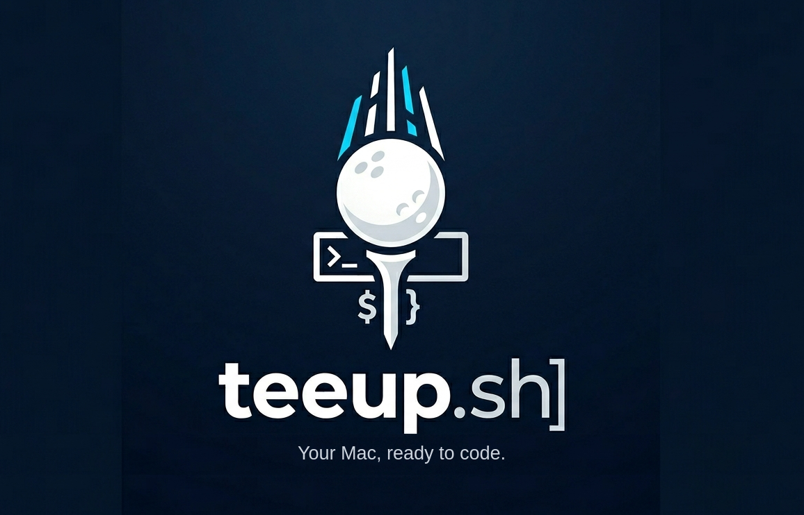

# Welcome to teeup

**Your Mac, ready to code.** teeup is an opinionated, reproducible macOS environment for developers. The `./bootstrap` command installs a set of developer tools, configures them, and sets one colour [theme](themes.md) and one [font](fonts.md). The `teeup` command manages changes after the installation.

The idea comes from [Omarchy](https://omarchy.org), the environment that DHH made for Arch Linux and Hyprland. Omarchy shows that a developer can distribute a personal environment with defaults, a discovery menu, lazy installations, and a manual. teeup brings this model to macOS, and runs on macOS only: on other systems, `./bootstrap` stops.

## What you get

After the first run of `./bootstrap`, you have:

- A zsh login shell with the teeup configuration, the [Starship prompt](prompt.md), and modern tools (ripgrep, fd, fzf, bat, eza, zoxide, and more).
- `git` with your identity, an ed25519 SSH key, and the signed-in GitHub CLI.
- `mise` for the language runtimes, WezTerm as the terminal, and the JetBrainsMono Nerd Font.
- AeroSpace to tile the windows, the Caps Lock key as the Control key, and the macOS preferences for development.
- Emacs, if you answer yes to the daily set.

All other tools wait until you request them. These include Zed, Obsidian, Firefox Developer Edition, Neovim, VS Code, Cursor, Docker through Colima, and the AI coding tools. When you first type `docker` or `claude`, teeup asks if you want to install the tool.

<!-- SCREENSHOT: A WezTerm window on a freshly bootstrapped Mac, showing the Starship prompt and the output of `teeup status`. -->

## How it is built

Each piece of teeup is a *capability*: a directory with a metadata file, an `install` script, and a `configure` script. For example, `git`, `wezterm`, `emacs`, `keyboard`, and `macos-defaults` are capabilities. The `teeup` command installs, configures, updates, resets, and removes them one at a time, and `teeup list` shows every capability.

teeup copies most configuration files one time, and after that they belong to you. teeup keeps its defaults in its checkout directory, so updates improve the defaults but do not overwrite your changes.

You can run `./bootstrap` again without risk, because every step checks before it acts. A second run repairs an incomplete first run.

## Who it is for

teeup is for users who work in a terminal and want to rebuild a Mac from the start in one session. They prefer to read about a tool before they run it. Every command that modifies the system has a dry run mode that prints the actions but does not run them.

teeup is an opinionated configuration that selects zsh, WezTerm, and `mise` for you and sets the macOS preferences. If you already keep your dotfiles in `chezmoi` or an older teeup, `teeup migrate legacy` removes that configuration, as [Migrating](migrating.md) explains.

This manual describes teeup 0.3.0-beta.

## Reading this manual

The pages are short, and each page covers one topic. Part 1, The Basics, helps you change a new Mac into a working environment:

- [Getting started](getting-started.md): the requirements, the first run, and the configuration questions.
- [The teeup command](the-teeup-command.md): every verb in one table.
- [The menu](the-menu.md): the same actions in one keyboard-driven list.
- [Tiers](tiers.md): what teeup installs now, and what waits for you.

The later parts describe the applications, the configuration, how to migrate to and from the environment, and how to troubleshoot.
